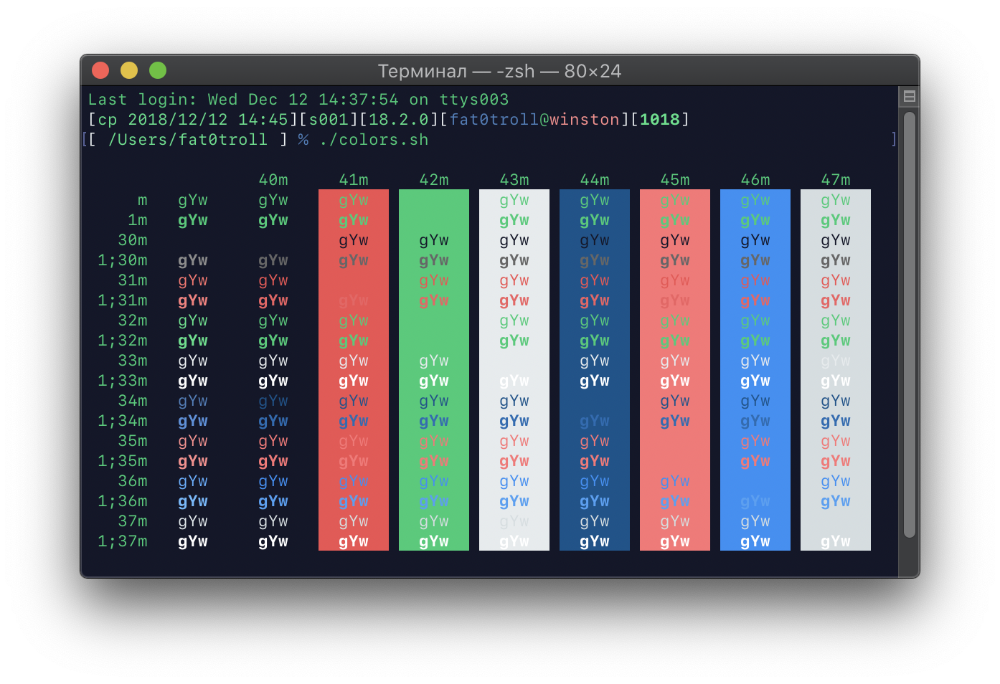
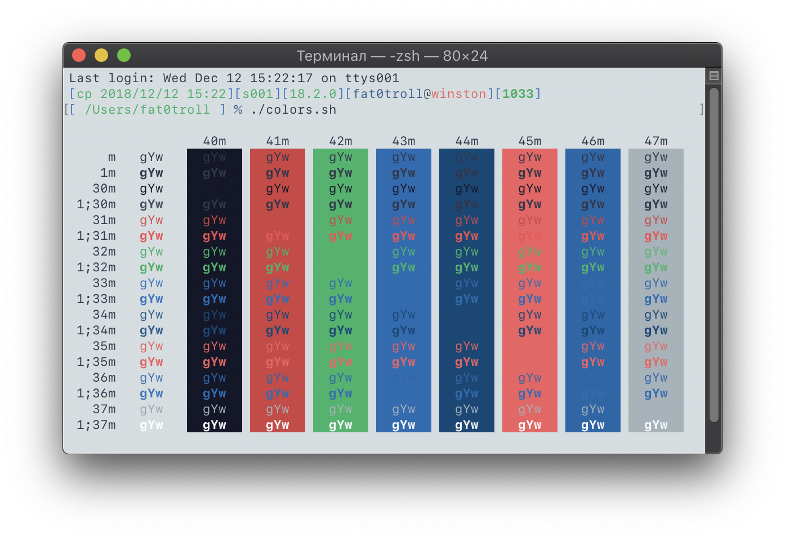

# Terminalus - Terminal.app theme inspired by Termius iOS app

This is Terminal.app theme, which mimics colors of terminal in [Termius](https://www.termius.com) app.

## How to install

If you want to install dark theme, download ``Terminalus Dark.terminal`` file.
If you want to install light theme, download ``Terminalus Light.terminal`` file.

1. Download chosen theme file to your desktop
2. Open Terminal.app
3. Open Preferences, go to Profiles tab
4. On the bottom of left pane find the gear wheel, click it and select Import
5. In Finder window select your newly downloaded file
6. Enjoy!

After importing, you can set your preferred window size, font and other settings
manually. This theme contains only color scheme and settings for it: all other
settings are inherited from macOS defaults.

## Screenshot

### Dark theme

### Light theme

Note the prompt theme: it is Stanislav Nikitin's [zsh-config](https://github.com/pztrn/zsh-config)!

## License

Do what you want with this file.

Termius name is a Crystalnix trademark. I am not affiliated with them in any means.